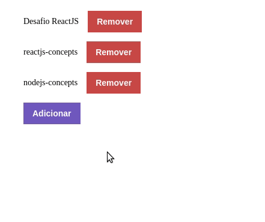

# reactjs-concepts
Conceitos do ReactJS. Desafio da Bootcamp GoStack da Rocketseat

Este aplicativo tem a finalidade de demonstrar a funcionalidade de adição e remoção de repositórios de uma lista. Você pode utiliza-la como interface de comnunicação com o servidor de repositórios **[deste repositório](https://github.com/marcelo-amorim/nodejs-concepts)**.

## :information_source: Sobre a aplicação

Esta interface ainda não está com todas as funcionalidades implementadas, mas já possui a funcionalidade de adicionar e remover repositórios.

  

## :white_check_mark: Requisitos

 - Yarn - gerenciador de pacotes;
 - Node.js - versão 10 ou superior;

## Como rodar o projeto

Esta aplicação é apenas uma demonstração dos conceitos básicos do ReactJS. Para rodar o projeto basta clona-lo em um diretório de sua preferência e em seguida, executar o comando `yarn` no seu terminal.
Após a instalação das dependências, você pode rodar o app com o comando `yarn start`.
Todas as funcionalidades foram testadas, mas se quiser conferir o relatório de testes, execute o comando `yarn test` no terminal.
Além disso, você pode gerar a build de produção com o comando `yarn build`.

## TODOS
 - Implementar inputs de cadastro do repositório (título, url e tecnologias utilizadas).
 - Implementar container de exibição de mensagens.

